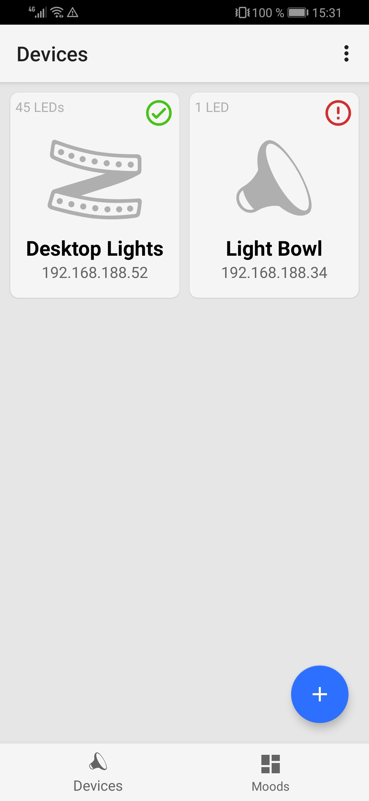
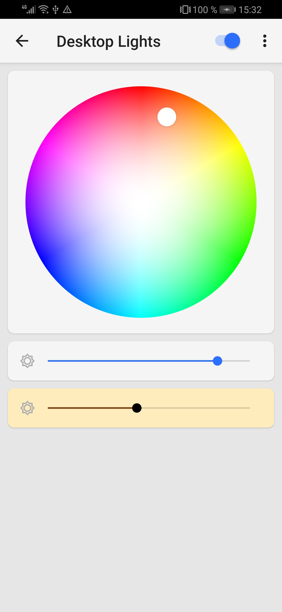
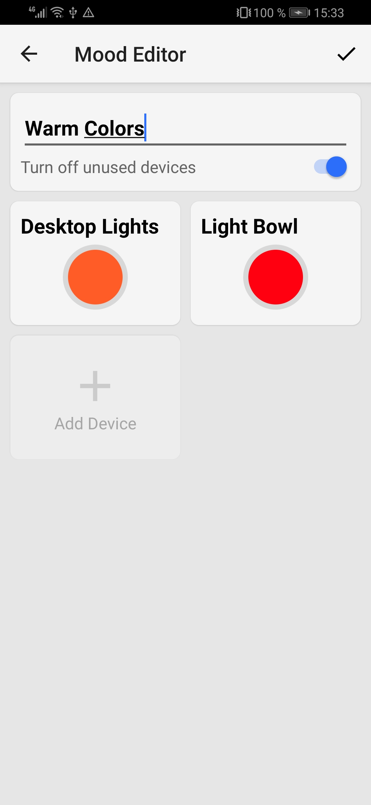

# Zinia - Lighting System

A simple and super broken lighting system for DIY lights using the ESP8266 chip. Its goal is it to control individual addressable RGB(W) light stripes in an easy way.

|Screenhots|||
|---|---|---|
| | |  |